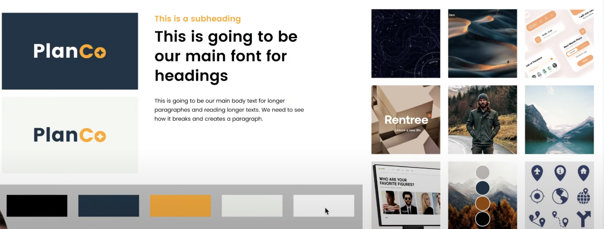
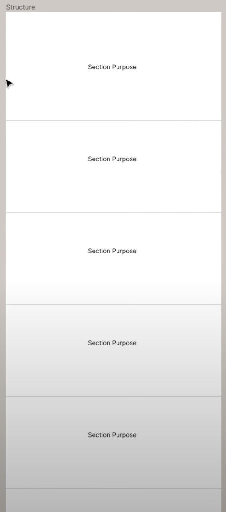
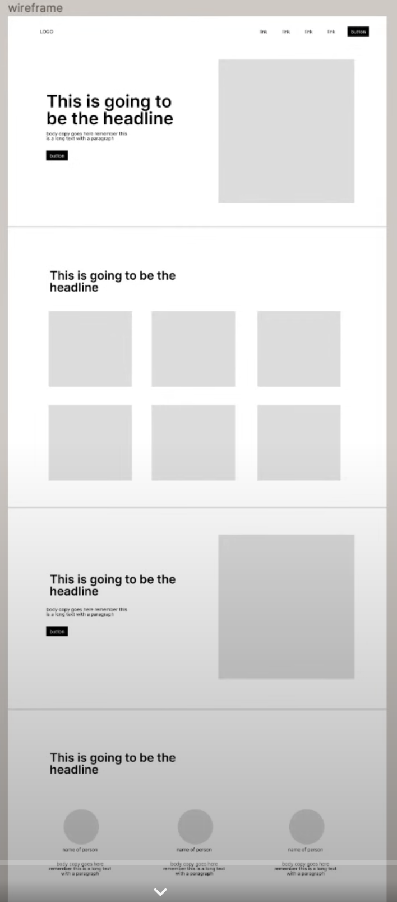
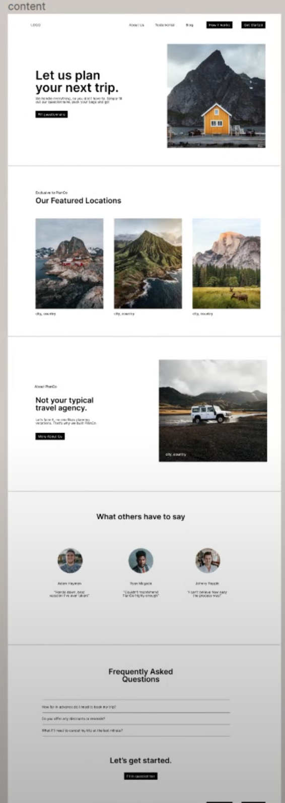
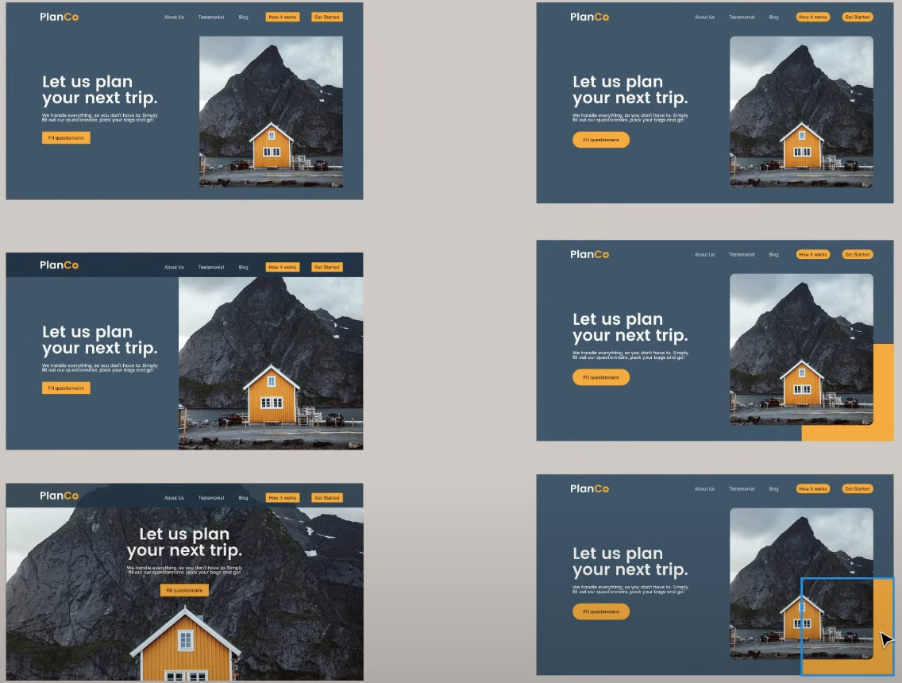

# Flux Academy Brief to Brand Kit: Workshop Day 1.

- Figma Template 1: https://www.figma.com/community/file/1134094203825976207
- Figma Template 2: https://www.figma.com/community/file/1134094203825976207

## Today's Agenda

- Review Brief
- Create Mood-board
- Define Colors
- Define Typography
- Design Logo
- Setup Brand Kit

## Brief - Stratagey Session

- Overview - General summary of business
- Product/Service - What exactyly are they selling.
- Market - Where and what is the market, who are the competitiors
- Goal - What is the goal for this website. The conversion goal as well.
- Customer Persona:
  - Demographics
  - Worldviews
  - Picture of customer

## Creative interpretation using Figma Pages

1. Inspiration Board

- Collect inspiration from competitors, 4 keywords from breif, unsplash, behance, pintrest.
- Gather pictures, colors, words, design layouts, anything that can inspire the design from the brief.

2. Mood board

- create a 3x3 grid of squares. Each square should be a picture from the inspiration board that makes a cohesive identity.
- Logo, colors, images, layouts, etc can all be a part of the mood board grid.

3. Colors

- Dark, Dark Shade, Accent (dramaticlly different), Light Shade, Light. 5 cohesive colors.
- color.adobe.com is a good playground of colors.

4. Typography

- Understand font families and designs. Choose ones that work on dark and light backgrounds.
- google fonts, adobe fonts, youworkforthem, dribble, fontawesome.

5. Logo

- icon and/or typeface.
- Use 6 keywords to help inspire the design that are "iconic".
- For the typeface, play around with the name of the company. Write it with space, without space, stacked, dot seperations, all caps, all lower, underlince, mix and match upper lower. etc. Blast options
- After playing with the typeface, add details and work towards an Icon that matches it. iconfinder.com can help.
- Always use the keywords to help match the desing choices.
- After the typeface and icon come together, make multiple sizes of logo. Full, medium, short, small, icon.

6. Brand Kit

- Bring everything together into a brand kit layout.
- 

# Flux Academy Brand Kit to Web Design: Workshop Day 2.

## Convert Brand Kit into Design.

1. Structure

- Layout each section and define the purpose of the section. Think of them as slides for a story/presentation.
  
- Make sure to use the brief as the backbone. Make each section a key part of the goals from the brief.
- Section 1 = Hero (who/ what do you do/ why should i care?)
- Section 2 = Get them excited (show them what they want!)
- Section 3 = Why work with us?
- Seciton 4 = Build trust.
- Section 5 = Call to action
- Footer

2. Wireframe

- Precursor to the design. Simply get all the parts into the section.
- Is there a headline, a button, subtext, image? What needs to be here?
- Image grids, customer reviews, faqs, etc. Lots of options out there. Again, not the design.
- The layout is not the design so stay basic.
- There are wireframing tools available.
- 

3. Content

- Use brief and brand kit to apply content to the wireframe.
- Fill in the pictures, words, colors, etc.
- 

4. Design

- Everything so far is NOT the design, and maybe not even close.
- Now it is time to apply design pricicples and techniques
- Apply a grid layout to design, 12 columns, centers, about 1200px wide in figma. This will be our guide
- The common cycle of creating variations, picking some, creating variations, picking some, and so on till it looks and feels correct, begins.
- freepik.com is a good resource for some things.
- 
